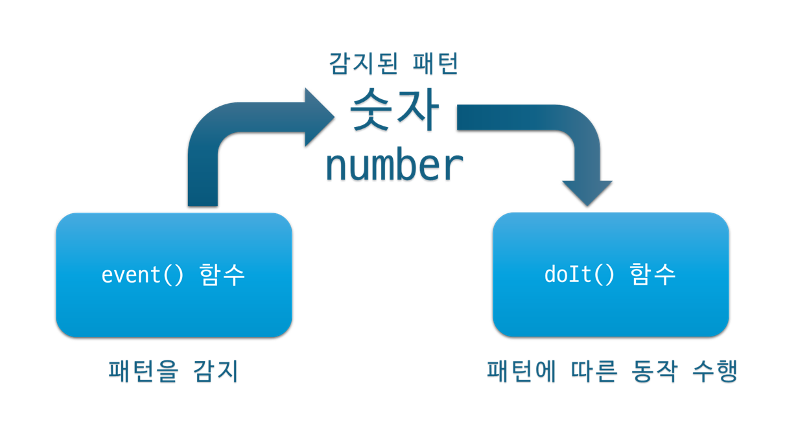
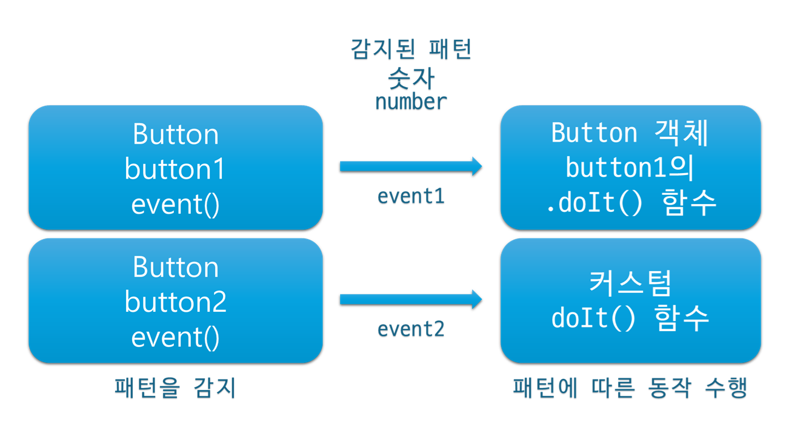
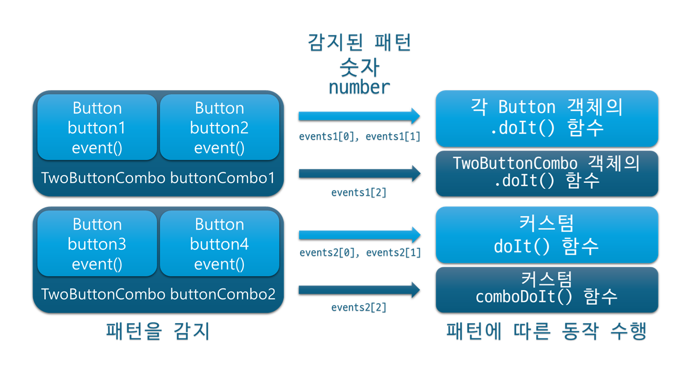
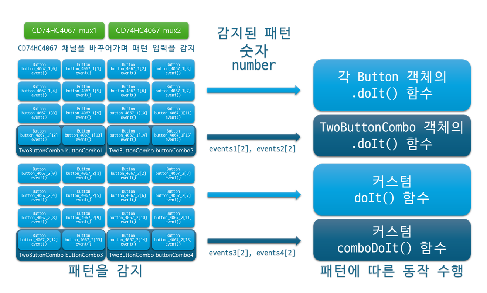
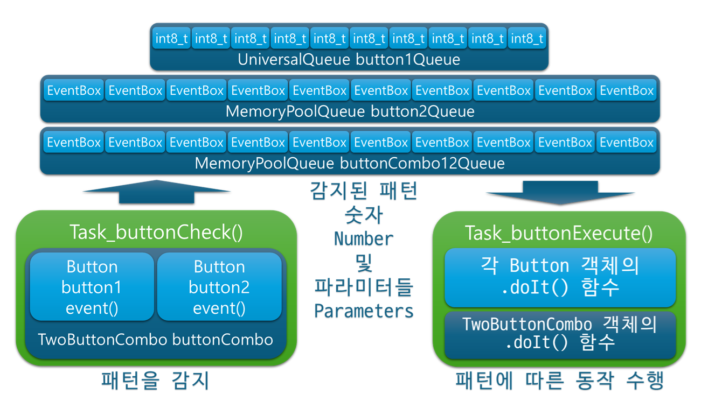

# RamjiButton  

<p align="center">
  
</p>

**이것은 개별 버튼 입력과 두 개 버튼 조합 입력을 감지하고 처리하는 아두이노 라이브러리입니다.**  
**Arduino library for detecting and responding to individual and two-button combination inputs.**

=> [영상 보기 : 단일 버튼 예제](https://www.youtube.com/watch?v=dMZLUDqXwbU)
<br>
=> [영상 보기 : 두 버튼 조합 예제](https://www.youtube.com/watch?v=FBTktjkJzaY)
<br>
=> [영상 보기 : CD74HC4067 2개 (총 32개 버튼) 예제](https://www.youtube.com/watch?v=ybIDMBN7uI0)
<br>
=> [영상 보기 : RP2040 듀얼 코어 두 버튼 조합 예제](https://www.youtube.com/watch?v=-1lTLU3tSH0)
<br>
=> [영상 보기 : FreeRTOS 두 버튼 조합 예제](https://www.youtube.com/watch?v=xHHuxweoOMI)

## 1. 라이브러리의 핵심  
### &nbsp;&nbsp;&nbsp;&nbsp;Core of the Library  

---

1. RamjiButton.h에 이렇게 생긴 enum이 정의되어 있는데, 이로 인해서 각 패턴에 **숫자**가 배정되어 있습니다.  
In RamjiButton.h, an enum is defined, assigning a number to each pattern.  

```cpp
enum ACTION {
  NO_ACTION, // 0
  CLICK, DOUBLECLICK, TRIPLECLICK, QUADCLICK, PENTACLICK, // 1, 2, 3, 4, 5
  HEXACLICK, HEPTACLICK, OCTACLICK, NONACLICK, DECACLICK, // 6, 7, 8, 9, 10
  LONGPRESS, MANYPRESS, // 11, 12
  NUMBER_OF_ACTIONS // 총 개수는 NO_ACTION(0)을 포함해서 13
};
```

---

2. **버튼 객체**를 생성합니다. Create a button instance.  

```cpp
#include "RamjiButton.h"
Button button(16, INPUT_PULLUP); // pin number, input mode.
```

---

3. 생성한 버튼 객체를 통해서 주기적으로 **event()** 함수를 호출합니다.  
**클릭, 더블 클릭, 다중 클릭, 롱 프레스, 계속적인 롱 프레스** 패턴이 감지되면,  
그에 해당하는 **숫자**를 반환값으로 받습니다.  
(특별한 패턴이 감지되지 않은 순간에는 NO_ACTION(0)을 받습니다.)  
   <br>
Periodically call the event() function through the created button instance.  
When a click, double click, multi-click, long press, or continuous long press pattern is detected,  
the corresponding number is returned.  
(When no specific pattern is detected, it returns NO_ACTION (0).)  

```cpp
void loop() {
    int8_t event = button.event();
    // 이렇게 event() 함수를 통해서,
    // NO_ACTION(0),
    // CLICK(1), DOUBLECLICK(2), TRIPLECLICK(3), QUADCLICK(4), PENTACLICK(5), 
    // HEXACLICK(6), HEPTACLICK(7), OCTACLICK(8), NONACLICK(9), DECACLICK(10), 
    // LONGPRESS(11), MANYPRESS(12) 중 한 가지 숫자를 받습니다.
}
```

---

4. 사용자는 인식한 패턴에 해당하는 이 숫자를 가지고 그에 따라 원하는 동작을 수행하면 됩니다.  
The user can then perform any desired action based on the number corresponding to the detected pattern.  

---

5. 이는 두 버튼 조합키를 쓸 때에도 마찬가지입니다. 두 버튼의 조합이라는 것은, 지정된 두 버튼의 **동시 클릭, 동시 더블 클릭, 동시 다중 클릭, 동시 롱 프레스, 두 버튼의 동시적이고 계속적인 롱 프레스** 패턴을 의미합니다. 이 경우에도 동일하게 숫자가 배정됩니다.  
   <br>
This works the same way for two-button combinations. A two-button combination means the simultaneous click, simultaneous double click, simultaneous multi-click, simultaneous long press, or simultaneous continuous long press of the specified two buttons. In this case as well, a number is assigned to each pattern.  

---

## 2. 라이브러리의 전체적인 구조  
### &nbsp;&nbsp;&nbsp;&nbsp;Overall Structure of the Library  

---

<p align="center">
  
</p>

---
 
## 3. 라이브러리 예제 코드에서 종종 마주치게 되는 것들  
### &nbsp;&nbsp;&nbsp;&nbsp;Common Elements Found in Example Codes  

---

* **Button 객체 (Button instance)**  
각 버튼마다 생성하는 객체입니다. button.event() 함수를 갖고 있습니다.  
An instance created for each individual button. It has the button.event() function.  

```cpp
Button button1(16, INPUT_PULLUP);
Button button2(17, INPUT_PULLUP);
```

---

* **TwoButtonCombo 객체 (TwoButtonCombo instance)**  
두 버튼 조합키 입력을 인식하려고 할 때 생성하는 객체입니다. 두 버튼의 Button 객체를 각각 생성하고 이를 통해서 생성합니다. buttonCombo.event() 함수를 갖고 있습니다.  
An instance created to detect two-button combination inputs. Create a Button instance for each of the two buttons, then use them to create this instance. It has the buttonCombo.event() function.  

```cpp
TwoButtonCombo buttonCombo(button1, button2);
```

---

* **CD74HC4067 객체 (CD74HC4067 instance)**  
CD74HC4067을 써서 핀의 개수를 확장하여 여러 버튼 입력을 받으려 할 때에 생성하는 CD74HC4067 객체입니다.  
An instance created when using the CD74HC4067 to expand the number of pins in order to receive multiple button inputs.  

```cpp
CD74HC4067 mux(cd4067_S0, cd4067_S1, cd4067_S2, cd4067_S3, cd4067_SIG_pin, INPUT_PULLUP);
mux.selectChannel(0-15);
```

---

* **button.event()**  
버튼 객체가 가진 이 함수를 통해서 각 버튼들의 입력을 인식할 수 있습니다.  
Through this function of the button instance, you can detect the input of each button.  

```cpp
int8_t event = button1.event();
```

---

* **button.doIt(int8_t a)**  
버튼 객체가 가진 기본 내장 구동 함수입니다. 기본 구동 함수 .doIt()은 파라미터가 없는 함수들을 동작시킬 수 있습니다. 동작 함수의 지정은 다음과 같이 할 수 있습니다.  
The built-in execution function of the button instance. The default .doIt() function can execute functions that take no parameters. You can assign action functions as follows.  

<details>
<summary>관련 코드 보기</summary>

```cpp
// 파라미터가 없는 동작 함수들.
void oneButtonLongPress() { Serial.println("one button long press."); }
void oneButtonManyPress() { Serial.println("one button many press."); }
void oneButtonClick() {  Serial.println("one button click."); }
void oneButtonDoubleClick() { Serial.println("one button double click."); }

////////////////////////////////////////////////////////////////////////////////////

// 방법1. 생성자 생성 시 기본 동작 함수를 지정.
Button button1(buttonPin01, INPUT_PULLUP, oneButtonLongPress, oneButtonManyPress, oneButtonClick, oneButtonDoubleClick); // 기본 구동 함수 쓸 때1. 이렇게 기본 동작 함수를 매치해서 쓰면 button.doIt()함수를 써서 구동한다.

// 방법2. 생성 후 차후에 setup()이나 loop()에서 기본 동작 함수를 지정.
Button button1(buttonPin01, INPUT_PULLUP);
void setup() {
    button1.onLongPress = oneButtonLongPress;
    button1.onManyPress = oneButtonManyPress;
    button1.onClick = oneButtonClick;
    button1.onDoubleClick = oneButtonDoubleClick;
}

////////////////////////////////////////////////////////////////////////////////////

// 기본 내장 구동 함수 .doIt() 호출. 감지된 패턴에 따라 앞서 지정된 함수들이 실행됩니다.
void loop() {
    int8_t event = button1.event();
    button1.doIt(event);
}
```

</details>

---

* **doIt(int8_t a)**  
커스텀 구동 함수. 구동 함수를 직접 만들어서 쓸 수 있습니다. 동작 함수들에 파라미터를 받고싶다거나 이런 저런 이유들로 인해서 좀 더 높은 자유도를 원할 때 쓸 수 있습니다.  
A custom execution function. You can create and use your own execution function. Use this when you want more flexibility, such as when you want the action functions to receive parameters.  

<details>
<summary>관련 코드 보기</summary>

```cpp
Button button1(buttonPin01, INPUT_PULLUP);

////////////////////////////////////////////////////////////////////////////////////

// 커스텀 구동 함수에 배치되는 함수들. 함수 이름은 꼭 이렇게 안해도 됨.
// 자유도가 높고 파라미터도 쉽게 쓸 수 있다.
void customOneButtonLongPress() { Serial.println("custom one button long press."); }
void customOneButtonManyPress() { Serial.println("custom one button many press."); }
void customOneButtonClick() { Serial.println("custom one button click."); }
void customOneButtonDoubleClick() { Serial.println("custom one button double click."); }

// 커스텀 구동 함수.
// event()함수만 거치면 그 동작이 아직 수행되기 전이다.
// NO_ACTION, CLICK, DOUBLECLICK, LONGPRESS, MANYPRESS 등등..
// 이런 반환값들을 숫자로 얻을 수 있는데.
// 이걸 실제 수행할 doIt() 같은 함수한테 던져주는 거다.
// 이러한 구동 함수에서는, 숫자값에 따른 동작 함수를 배정해주면 된다.
// 원하면 파라미터를 넣어서 쓰자.
void doIt(int8_t a) { // 단순히 받은 숫자에 대한 스위치문입니다. 얼마든지 직접 만들어 쓰셔도 됩니다.
  if (a != NO_ACTION) {
    switch (a) {
      case NO_ACTION: break;
      case LONGPRESS: customOneButtonLongPress(); break;
      case MANYPRESS: customOneButtonManyPress(); break;
      case CLICK: customOneButtonClick(); break;
      case DOUBLECLICK: customOneButtonDoubleClick(); break;
      default: break;
    }
  }
}

////////////////////////////////////////////////////////////////////////////////////

void loop() {
    int8_t event = button1.event();
    doIt(event); // 함수 이름도 꼭 doIt일 필요가 없습니다.
}
```

</details>

---

* **buttonCombo.event()**  
이것은 버튼 콤보 (TwoButtonCombo) 객체가 가진 event() 함수입니다. 이 buttonCombo.event()를 쓰게 되면 두 버튼 조합키 입력을 인식할 수 있게 됩니다. 이 경우 각 버튼들의 button.event() 함수는 쓰지 않고, buttonCombo.event() 함수만 씁니다.  
버튼 콤보 객체의 event() 함수는 크기 3인 숫자 배열의 주소값을 포인터로 반환하는데, 버튼1만의 입력이 감지되면 그 숫자가 events[0]에 있고, 버튼2만의 입력이 감지되면 그 숫자가 events[1]에 있고, 버튼1과 버튼2의 조합 입력이 감지되면 그 숫자가 events[2]에 있어서 포인터를 통해 이를 읽을 수 있습니다.  
  <br>
This is the event() function belonging to the button combo (TwoButtonCombo) instance. By using this buttonCombo.event() of the combo instance, you can detect two-button combination inputs. In this case, you do not use each button’s button.event() function, but only the buttonCombo.event() function.  
The event() function of a combo instance returns a pointer to an integer array of size 3.  
If only Button 1’s input is detected, that number is in events[0].  
If only Button 2’s input is detected, that number is in events[1].  
If a combination input of Button 1 and Button 2 is detected, that number is in events[2].  
You can read these values via the pointer.  

```cpp
int8_t* events = buttonCombo.event();

int8_t button1Event = events[0]; // 버튼1만 누르면 해당 숫자가 여기 저장됨.
int8_t button2Event = events[1]; // 버튼2만 누르면 해당 숫자가 여기 저장됨.
int8_t button1button2ComboEvent = events[2]; // 버튼1과 버튼2를 동시에 누르면 해당 숫자가 여기 저장됨.
```

---

* **buttonCombo.doIt(int8_t a)**  
버튼 콤보 객체가 가진 기본 내장 구동 함수입니다. 파라미터가 없는 함수들을 동작시킬 수 있습니다. 동작 함수의 지정은 다음과 같이 할 수 있습니다.  
The built-in execution function of the combo instance. It can execute functions that take no parameters. You can assign action functions as follows.  

<details>
<summary>관련 코드 보기</summary>

```cpp
Button button1(buttonPin01, INPUT_PULLUP, oneButtonLongPress, oneButtonManyPress, oneButtonClick, oneButtonDoubleClick); // 기본 구동 함수 쓸 때1. 이렇게 기본 동작 함수를 매치해서 쓰면 button.doIt()함수를 써서 구동한다.
Button button2(buttonPin02, INPUT_PULLUP, oneButtonLongPress, oneButtonManyPress, oneButtonClick, oneButtonDoubleClick);

////////////////////////////////////////////////////////////////////////////////////

// 파라미터가 없는 동작 함수들.
void twoButtonLongPress() { Serial.println("two button long press."); }
void twoButtonManyPress() { Serial.println("two button many press."); }
void twoButtonClick() { Serial.println("two button click."); }
void twoButtonDoubleClick() { Serial.println("two button double click."); }

////////////////////////////////////////////////////////////////////////////////////

// 방법1. 생성자 생성 시 기본 동작 함수를 지정.
TwoButtonCombo buttonCombo(button1, button2, nullptr, -1, -1, twoButtonLongPress, twoButtonManyPress, twoButtonClick, twoButtonDoubleClick); // 두 버튼 조합키 기본 동작들을 이렇게 생성자에서 등록할 수도 있다. 이러한 함수들은 buttonCombo.doIt()을 통해 수행된다.

// 방법2. 생성 후 차후에 setup()이나 loop()에서 기본 동작 함수를 지정.
TwoButtonCombo buttonCombo(button1, button2);
void setup() {
    // 두 버튼 조합키 기본 동작 함수들을 등록할 수 있다. buttonCombo.doIt()을 통해 수행된다.
    buttonCombo.onLongPress = twoButtonLongPress;
    buttonCombo.onManyPress = twoButtonManyPress;
    buttonCombo.onClick = twoButtonClick;
    buttonCombo.onDoubleClick = twoButtonDoubleClick;
}

////////////////////////////////////////////////////////////////////////////////////

// 기본 내장 구동 함수 .doIt() 호출. 감지된 패턴에 따라 앞서 지정된 함수들이 실행됩니다.
void loop() {
    int8_t* events = buttonCombo.event(); // 전체 이벤트 감지.

    // 독립 동작 판정시 버튼1 독립 동작 수행.
    if(events[0]) { buttonCombo.getBt1().doIt(events[0]); } // 등록된 button1의 기본 독립 동작 수행.
    // 독립 동작 판정시 버튼2 독립 동작 수행.
    if(events[1]) { buttonCombo.getBt2().doIt(events[1]); } // 등록된 button2의 기본 독립 동작 수행.
    // 두 버튼 조합 동작 판정시 두 버튼 조합 동작 수행.
    if(events[2]) { buttonCombo.doIt(events[2]); } // 등록된 기본 조합 동작 수행.
}
```

</details>

---

* **comboDoIt(int8_t a)**  
두 버튼 콤보 조합 동작을 위한 커스텀 구동 함수. 커스텀으로 만들어 쓰는 doIt() 함수의 변형입니다.  
A custom execution function for two-button combination actions. It is a variation of the custom-made doIt() function.  

<details>
<summary>관련 코드 보기</summary>

```cpp
Button button1(buttonPin01, INPUT_PULLUP);
Button button2(buttonPin02, INPUT_PULLUP);
TwoButtonCombo buttonCombo(button1, button2);

////////////////////////////////////////////////////////////////////////////////////

// 한 버튼 커스텀 구동 함수에 배치되는 함수들. 함수 이름은 꼭 이렇게 안해도 됨.
// 자유도가 높고 파라미터도 쉽게 쓸 수 있다.
void customOneButtonLongPress() { Serial.println("custom one button long press."); }
void customOneButtonManyPress() { Serial.println("custom one button many press."); }
void customOneButtonClick() { Serial.println("custom one button click."); }
void customOneButtonDoubleClick() { Serial.println("custom one button double click."); }

// 한 버튼 커스텀 구동 함수.
// 원하면 파라미터를 넣어서 쓰자.
void doIt(int8_t a) {
  if (a != NO_ACTION) {
    switch (a) {
      case NO_ACTION: break;
      case LONGPRESS: customOneButtonLongPress(); break;
      case MANYPRESS: customOneButtonManyPress(); break;
      case CLICK: customOneButtonClick(); break;
      case DOUBLECLICK: customOneButtonDoubleClick(); break;
      default: break;
    }
  }
}

////////////////////////////////////////////////////////////////////////////////////

void customTwoButtonLongPress() { Serial.println("custom two button long press."); }
void customTwoButtonManyPress() { Serial.println("custom two button many press."); }
void customTwoButtonClick() { Serial.println("custom two button click."); }
void customTwoButtonDoubleClick() { Serial.println("custom two button double click."); }

// 커스텀으로 만든 두 버튼 조합 동작용 구동 함수.
// 두 버튼 동시에 누르는 "조합 동작"만 수행한다.
// 원하면 파라미터를 넣어서 쓰자.
void comboDoIt(int8_t a) {
  // Serial.println(a); // 디버깅.. 이 함수가 실행은 되었는지, 어느 액션 번호를 받았는지 확인.
  if (a != NO_ACTION) { // <= 이거 생각보다 중요할 수 있으니 지우지 않는 게 좋음. if(a)라고 해도 되지만 이게 조금 더 명시적이어서 이렇게 해놓음.
    switch (a) {
      case NO_ACTION: break;
      case LONGPRESS: customTwoButtonLongPress(); break;
      case MANYPRESS: customTwoButtonManyPress(); break;
      case CLICK: customTwoButtonClick(); break;
      case DOUBLECLICK: customTwoButtonDoubleClick(); break;
      default: break;
    }
  }
}

////////////////////////////////////////////////////////////////////////////////////

// 커스텀 구동 함수 호출. 감지된 패턴에 따라 앞서 지정된 함수들이 실행됩니다.
void loop() {
    int8_t* events = buttonCombo.event(); // 전체 이벤트 감지.

    // 독립 동작 판정시 버튼1 독립 동작 수행.
    if(events[0]) { doIt(events[0]); } // button1의 커스텀 독립 동작 수행.
    // 독립 동작 판정시 버튼2 독립 동작 수행.
    if(events[1]) { doIt(events[1]); } // button2의 커스텀 독립 동작 수행.
    // 두 버튼 조합 동작 판정시 두 버튼 조합 동작 수행.
    if(events[2]) { comboDoIt(events[2]); } // 두 버튼의 커스텀 조합 동작 수행.
}
```

</details>

---

## 4. 라이브러리 examples 예제들 설명  
### &nbsp;&nbsp;&nbsp;&nbsp;Description of Example Sketches in the examples Folder  

---

### 1. SingleButtons_BasicAndCustom  

<p align="center">
  
</p>

- 이 예제는 버튼 2개를 조합 없이 각각 독립적으로 동작시키는 예제입니다.  
- 버튼의 객체 button1, button2를 생성한 후에, 각각 이벤트를 감지.  
- button1은 기본 동작 함수들을 지정해서 button1 객체의 기본 내장 .doIt() 함수로 구동하고,  
- button2의 동작은 커스텀으로 doIt() 구동 함수를 통해서 구동합니다.  
  <br>
- This example is an example where two buttons operate independently without combination.  
- After creating the button instances button1 and button2, events are detected for each.  
- button1 is configured with default action functions and operates using the built-in .doIt() function of the button1 instance,  
- and the operation of button2 is executed through a custom .doIt() execution function.  
  <br>
   => [SingleButtons_BasicAndCustom 예제 보기](examples/01_SingleButtons_BasicAndCustom/SingleButtons_BasicAndCustom.ino)
  <br>
   => [SingleButtons_BasicAndCustom 영상 보기](https://www.youtube.com/watch?v=dMZLUDqXwbU)

---

### 2. ComboButtons_BasicAndCustom  

<p align="center">
  
</p>

- 이 예제는 두 버튼 조합 감지가 가능한 버튼 콤보 객체 2개를 각각 동작시키는 예제입니다.  
- 총 4개의 버튼을 2개, 2개씩 써서 서로 다른 버튼 콤보 객체를 2개 만든 후에, 각 콤보 객체들로 모든 이벤트들을 감지.
- buttonCombo1은 기본 동작 함수들을 지정해서 버튼 객체들과 버튼 콤보 객체의 기본 내장 .doIt() 함수로 구동하고,  
- buttonCombo2의 동작은 커스텀으로 doIt(), comboDoIt() 구동 함수를 통해서 구동합니다.  
  <br>
- This example is an example where two button combo instances that can detect two-button combinations are operated separately.  
- A total of four buttons are used, two for each, to create two different button combo instances, and all events are detected through each combo instance.  
- buttonCombo1 is configured with default action functions and operates using the built-in .doIt() functions of the button instances and the button combo instance,  
- and the operation of buttonCombo2 is executed through the custom .doIt() and comboDoIt() execution functions.  
  <br>
   => [ComboButtons_BasicAndCustom 예제 보기](examples/02_ComboButtons_BasicAndCustom/ComboButtons_BasicAndCustom.ino)
  <br>
   => [ComboButtons_BasicAndCustom 영상 보기](https://www.youtube.com/watch?v=FBTktjkJzaY)

---

### 3. CD74HC4067_32Buttons_BasicAndCustom  

<p align="center">
  
</p>

- CD74HC4067은 1개당 16개의 버튼을 연결할 수 있습니다. 이 예제에서는 2개의 CD74HC4067 객체를 생성하고, 각 16개씩 총 32개의 버튼을 다룹니다.  
- 각 CD74HC4067마다 채널 0 ~ 11은 각각 단일 버튼으로 패턴을 감지하고, 채널 12 ~ 13, 14 ~ 15는 두 버튼 콤보 조합으로 패턴 입력을 감지.  
- CD74HC4067_1은 기본 동작 함수들을 지정해서 버튼 객체들과 버튼 콤보 객체의 기본 내장 .doIt() 함수로 구동하고,  
- CD74HC4067_2의 동작은 커스텀으로 doIt(), comboDoIt() 구동 함수를 통해서 구동합니다.
- CD74HC4067 사용 시 버튼 콤보 (TwoButtonCombo) 객체를 생성할 때 이와 관련된 CD74HC4067의 정보를 넣어줘야 합니다.  
  <br>
- Each CD74HC4067 can connect up to 16 buttons. In this example, two CD74HC4067 instances are created, and a total of 32 buttons are handled, 16 for each.  
- For each CD74HC4067, events are detected on channels 0–11 as individual button patterns, while channels 12–13 and 14–15 detect patterns from two-button combinations.    
- CD74HC4067_1 is configured with default action functions and operates using the built-in .doIt() functions of the button instances and button combo instances,  
- and the operation of CD74HC4067_2 is executed through the custom .doIt() and comboDoIt() execution functions.  
- When using CD74HC4067, when creating a button combo (TwoButtonCombo) instance, information related to the corresponding CD74HC4067 must be provided.  
  <br>
   => [CD74HC4067_32Buttons_BasicAndCustom 예제 보기](examples/03_CD74HC4067_32Buttons_BasicAndCustom/CD74HC4067_32Buttons_BasicAndCustom.ino)
  <br>
   => [CD74HC4067_32Buttons_BasicAndCustom 영상 보기](https://www.youtube.com/watch?v=ybIDMBN7uI0)

---

### 4. DualCore_ButtonCheckAndAction  

<p align="center">
  
</p>

- 이 예제는 라즈베리파이 피코의 듀얼 코어를 사용해서 버튼의 패턴 감지 buttonCheck()와, 감지된 패턴에 따른 동작 수행 buttonExecute()을 병렬로 수행하는 예제입니다.  
- 피코 보드에서 가능합니다. 피코에서 무사히 테스팅되었으나, 듀얼 코드를 지원하는 다른 보드에서도 이 코드가 잘 작동하는지는 보드가 없어 테스트하지 못했습니다.  
- 버튼1, 버튼2, 버튼1과 버튼2 콤보, 이렇게 3가지 패턴 감지를 저장하는 큐를 각각 따로 썼습니다.  
- 패턴 감지부에서는, 패턴을 감지하면 해당 숫자를 비교적 간단히 UniversalQueue 큐에 저장하거나,  
필요 시 큐에 파라미터들을 함께 저장하기 위해서 EventBox 구조체와 MemoryPoolQueue를 사용합니다.  
- 버튼1의 입력 감지는 큐에 감지된 숫자만 저장하고, 버튼2, 버튼1과 버튼2 콤보 입력 감지는 파라미터를 함께 저장하는 EventBox와 MemoryPoolQueue 방식을 썼습니다.  
- 패턴에 따른 동작 수행부에서는, 큐에 들어있는 것이 있으면 꺼내서 기본 구동 함수 .doIt()이나 커스텀 구동 함수를 구동합니다.  
- EventBox와 MemoryPoolQueue 사용 시 queue.allocate()와 queue.free() 관련 프로세스 관리를 확실히 해주는 것이 필요합니다. EventBox를 꺼내 쓴 후에는 반드시 잊지않고 queue.free()를 해주어야 합니다.  
  <br>
- This example uses the dual cores of the Raspberry Pi Pico to perform the button pattern detection buttonCheck() and the action execution buttonExecute() corresponding to the detected pattern in parallel.  
- It is available on the Pico board. It has been tested successfully on the Pico, but it has not been tested on other boards that support dual cores due to lack of availability.  
- Three queues are used separately to store detections for button1, button2, and button1 + button2 combo.  
- In the pattern detection part, when a pattern is detected, the detected number is simply stored in the UniversalQueue,  
- or, when parameters need to be stored together in the queue, the EventBox structure and MemoryPoolQueue are used.  
- Detection of button1 inputs stores only the detected number in the queue, while detection of button2 and button1 + button2 combo inputs uses the EventBox and MemoryPoolQueue method to store parameters together.  
- In the action execution part, if there is an item in the queue, it is taken out and executed via the built-in .doIt() function or a custom execution function.  
- When using EventBox and MemoryPoolQueue, it is necessary to reliably manage the processes related to queue.allocate() and queue.free().  
- After using an EventBox, be sure to call queue.free() without forgetting.  
  <br>
   => [DualCore_ButtonCheckAndAction 예제 보기](examples/04_DualCore_ButtonCheckAndAction/DualCore_ButtonCheckAndAction.ino)
  <br>
   => [DualCore_ButtonCheckAndAction 영상 보기](https://www.youtube.com/watch?v=-1lTLU3tSH0)

---

### 5. FreeRTOS_ButtonCheckAndAction  

<p align="center">
  
</p>

- 이 예제는 앞서 테스팅 된 듀얼 코어 예제를 FreeRTOS 환경에서 작동하도록 만든 것입니다.  
- FreeRTOS를 사용해서 버튼의 패턴 감지 Task_buttonCheck()와, 감지된 패턴에 따른 동작 수행 Task_buttonExecute()을 병렬로 수행합니다.  
- 버튼1, 버튼2, 버튼1과 버튼2 콤보, 이렇게 3가지 패턴 감지를 저장하는 큐를 각각 따로 썼습니다.  
- 패턴 감지부에서는, 패턴을 감지하면 해당 숫자를 비교적 간단히 UniversalQueue 큐에 저장하거나,  
필요 시 큐에 파라미터들을 함께 저장하기 위해서 EventBox 구조체와 MemoryPoolQueue를 사용합니다.  
- 버튼1의 입력 감지는 큐에 감지된 숫자만 저장하고, 버튼2, 버튼1과 버튼2 콤보 입력 감지는 파라미터를 함께 저장하는 EventBox와 MemoryPoolQueue 방식을 썼습니다.  
- 패턴에 따른 동작 수행부에서는, 큐에 들어있는 것이 있으면 꺼내서 기본 구동 함수 .doIt()이나 커스텀 구동 함수를 구동합니다.  
- EventBox와 MemoryPoolQueue 사용 시 queue.allocate()와 queue.free() 관련 프로세스 관리를 확실히 해주는 것이 필요합니다. EventBox를 꺼내 쓴 후에는 반드시 잊지않고 queue.free()를 해주어야 합니다.  
  <br>
- This example is a version of the previously tested dual-core example made to work in a FreeRTOS environment.  
- Using FreeRTOS, the button pattern detection Task_buttonCheck() and the action execution Task_buttonExecute() corresponding to the detected pattern are performed in parallel.  
- Three queues are used separately to store detections for button1, button2, and button1 + button2 combo.  
- In the pattern detection part, when a pattern is detected, the detected number is simply stored in the UniversalQueue,  
- or, when parameters need to be stored together in the queue, the EventBox structure and MemoryPoolQueue are used.  
- Detection of button1 inputs stores only the detected number in the queue, while detection of button2 and button1 + button2 combo inputs uses the EventBox and MemoryPoolQueue method to store parameters together.  
- In the action execution part, if there is an item in the queue, it is taken out and executed via the built-in .doIt() function or a custom execution function.  
- When using EventBox and MemoryPoolQueue, it is necessary to reliably manage the processes related to queue.allocate() and queue.free().  
- After using an EventBox, be sure to call queue.free() without forgetting.  
  <br>
   => [FreeRTOS_ButtonCheckAndAction 예제 보기](examples/05_FreeRTOS_ButtonCheckAndAction/FreeRTOS_ButtonCheckAndAction.ino)
  <br>
   => [FreeRTOS_ButtonCheckAndAction 영상 보기](https://www.youtube.com/watch?v=xHHuxweoOMI)

---
